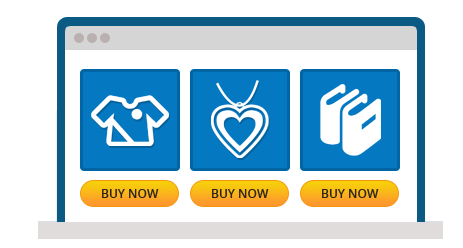

## <b>Case Study I. E-Commerce</b> 

For this case study, imagine that you want to build dimestore, an online store. You use Couchbase Server to store variety of different data – everything from product details, and customer information, to purchase and review histories.
 
 

Now, lets look at how N1QL can be used to solve some typical e-commerce scenarios. 
For the sake of this tutorial, let is assume that the data for our application is kept in 4 different couchbase buckets :
<ul>
<li>
<b>product</b> This bucket contains a list of products to be sold, the categories to which they belong, price of each product, and other product info</li>
<li><b>customers</b> This bucket contains customer information such as the name, address, and the customers credit card details</li>
<li><b>purchases</b> This bucket contains a list of purchases made by a customer - each document contains a list of items purchased and the quantity of each item purchased</li>
<li><b>reviews</b> This bucket contains a list of reviews made by a customer or specific product. Each review is scored from 0 to 5</li>
</ul>

There are 2 types of users of our application :
<ul>
<li><b>Shopper</b> The shopper is the consumer and uses the application to buy products online.</li>
<li><b>Merchant</b> An employee of dimestore</li>
</ul>

<b>Counting all the products</b>
 
Don shops online at dimestore. When he visits the homepage, it displays a count of all the products.  

<pre id="example">
SELECT 
  COUNT(*) AS product_count 
	FROM product
</pre>
